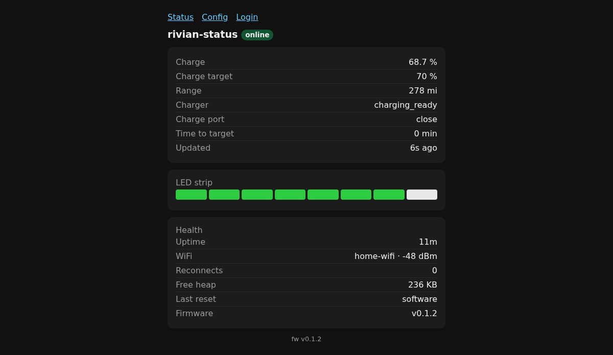
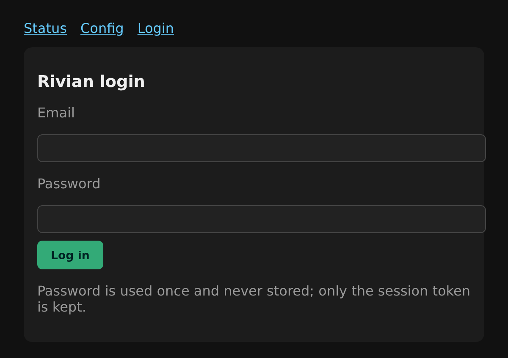
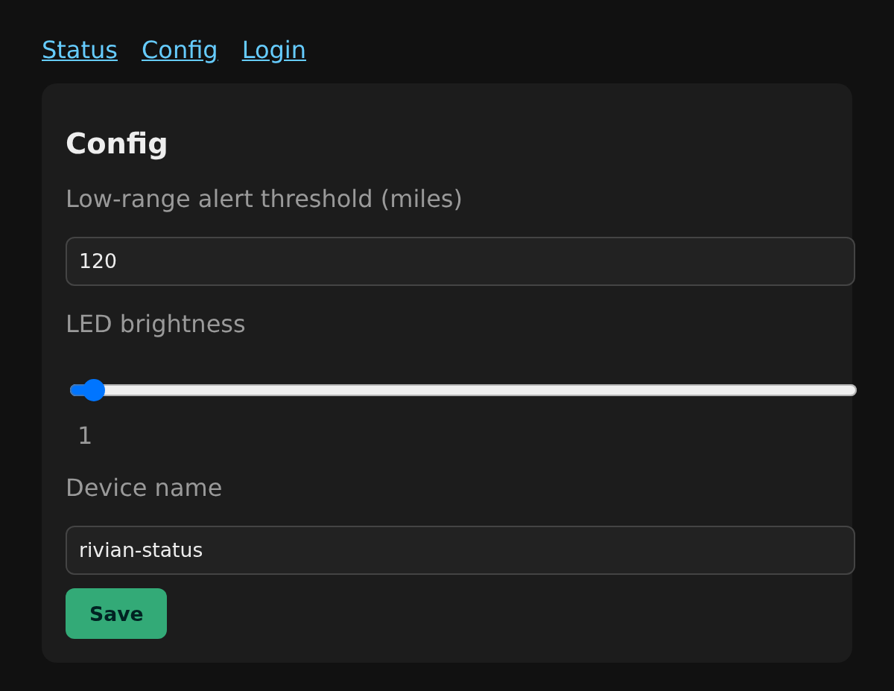
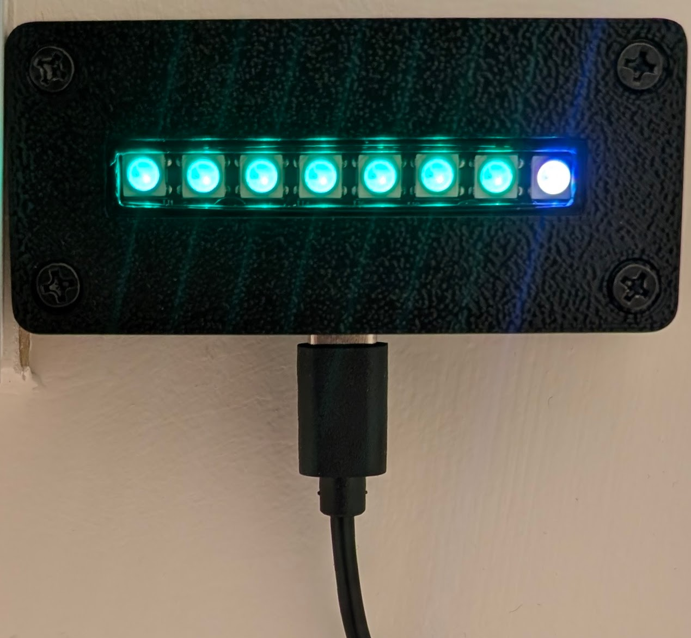

# rivian-status

A small, headless **desk light that shows your Rivian's charge status at a glance.** An
ESP32-S3 polls your Rivian over WiFi (via the unofficial cloud API, read-only) and renders
charge level, charging activity, low-range warnings, and connection health onto an 8-pixel
WS2812 LED strip. No screen — everything (Rivian login incl. MFA, WiFi, settings) is set up in
a browser. It lives behind a 3D-printed enclosure and runs off USB-C.

> **Unofficial & read-only.** Rivian publishes no public API; this reverse-engineers the app's
> cloud GraphQL endpoint for *read-only telemetry* (no vehicle commands, no crypto). Endpoints
> can change without notice. See [`research/`](research/). Not affiliated with Rivian.

---

## What it does

- Reads your Rivian's **charge %, charge target, range, charging state, and plug state** every
  30 s (`getVehicleState`), with exponential backoff on errors.
- Shows it on the **LED meter** (below) — readable across the room, no screen.
- Serves a tiny **web UI** for status, Rivian login (email + password + MFA/OTP), WiFi, and
  settings (low-range threshold, LED brightness, device name).
- Provisions WiFi via a **SoftAP captive portal** on first boot, and supports **wireless OTA**
  firmware updates after that. Only session tokens are stored (never your password).

## Build one from scratch

Start to finish on a brand-new board. The electronics and setup take about half an hour; the case
print is a few hours on its own, so start that first if you're printing one.

**1. Get the parts.** A [Seeed XIAO ESP32-S3](#parts), an 8-pixel WS2812 stick, a ~330 Ω resistor
and a USB-C supply. Full list with links in [Parts](#parts).

> ⚠️ **Plug the external U.FL antenna in.** The XIAO's WiFi is unusable without it, and the
> failure looks exactly like a wrong WiFi password — this wastes an afternoon if you don't know it.

**2. Print the case** and wire the stick to the board — [enclosure](#the-enclosure-case) and
[wiring](#wiring). You can do this after step 3 if you'd rather see it running on the bench first.

**3. Flash it the first time, over USB.** Plug the board into a computer — it shows up as a USB
serial port (`303A:1001`). Pick **one** of these; after this first flash everything is wireless.

Wireless (OTA) can't do the first flash: a factory-fresh board has no bootloader, and OTA replaces
only the app. So the first flash must write the whole layout over USB — which is exactly what the
merged image below is.

<details open>
<summary><b>Option A — flash the prebuilt image (no toolchain)</b></summary>

Download **`firmware-status-full.bin`** from the
[latest release](https://github.com/wjduenow/rivian-status/releases/latest) — a single
full-flash image (bootloader + partition table + app) built and published by CI.

- **In a browser (easiest):** open the [ESP web flasher](https://espressif.github.io/esptool-js/),
  Connect, set the offset to **`0x0`**, choose the file, and Program. Works in Chrome/Edge over
  WebSerial — no install.
- **From a terminal:**
  ```bash
  pip install esptool
  esptool.py --chip esp32s3 write_flash 0x0 firmware-status-full.bin
  ```

The build published this way carries no baked-in secrets, so it comes up in first-boot setup mode
(next step) — and its wireless-flash listener has no password, so keep it on a network you trust.
</details>

<details>
<summary><b>Option B — build from source</b></summary>

Gives you a build you can set an OTA password on, and is the path for development.

```bash
pip install platformio                                    # if you don't have it
git clone https://github.com/wjduenow/rivian-status && cd rivian-status
pio run -e phase3 -t upload --upload-port /dev/ttyACM0    # or COMx / /dev/cu.usbmodem*
```

PlatformIO usually finds the port on its own, so you can drop `--upload-port`. You do **not** need
to create `include/secrets.h` — omitting it is the supported path, and it's how the release image
above is built. See [Building & flashing](#building--flashing-developer-reference) for details.
</details>

**4. Join it to your WiFi.** On first boot it has no credentials, so it raises its own hotspot:

- Join the open network **`rivian-status-setup`** from a phone or laptop.
- A setup page opens (or browse to `http://192.168.4.1/`). Pick your network, enter the password,
  optionally rename the device, and hit **Join**.
- It reboots onto your WiFi. The hotspot disappears.

**5. Sign in to Rivian.** Browse to **`http://rivian-status.local/`** (or its IP — check your
router if `.local` doesn't resolve, which is common on Windows/WSL). Open **Login**, enter your
Rivian email and password, then the MFA code that arrives **by email**. Only the session token is
stored, never your password.

**6. Done — it starts polling.** The meter comes alive within 30 seconds. On **Config**, set your
[mounting orientation](#mounting-orientation) so the meter fills the right way for how you hung it,
plus the low-range threshold and LED brightness. Turn on
[automatic updates](#firmware-updates) and it keeps itself current from then on.

**Troubleshooting the first boot:** if no hotspot appears, the board is probably already joined to
a network (check your router) — or the antenna isn't connected. If the LEDs stay dark, re-check the
data line on `D10` and that the stick's 5 V comes from the `5V` pin, not `3V3`.

## The LED indicator

The **whole strip is one meter**, filled by **charge % ÷ your charge target** (so "full" = you
hit your set charge limit, e.g. 70 %, not 100 %):

| State | Strip shows |
|---|---|
| **Charging** | meter in place; the **closest empty pixel slow-pulses green** (the cell filling), climbing as it charges |
| **Not charging, range OK** | meter: **green** filled up to charge level, **white** for the rest |
| **Not charging, range below your threshold** | **all pixels flash red** (low-range / "go plug in" alert) |
| **At / above target** | **all green** |
| **Link down** (offline / needs login) | **pixel 0 pulses red**, rest off |
| **OTA update running** | whole strip = a **blue progress bar** |

Brightness is adjustable on the config page. The status web page also shows a live **preview**
of the strip below the data table.

### Mounting orientation

The light is a **meter**, and where you can hang it depends on where the power is — so which end
reads as "the top" isn't fixed. The config page lets you say **where the plug comes out**
(bottom / left / top / right, as four little diagrams), and the firmware rotates the meter to
suit. The rule it keeps is:

> the meter always fills toward the **top** when it ends up vertical, and toward the **right**
> when it ends up sideways.

So you can mount it whichever way the outlet allows and it still reads the same. Two extra
settings pin it down completely:

- **Enclosure** — v1's bar runs *across* the case, v2's runs *up-down*, so the same quarter turn
  lands them on different axes. Set once per unit.
- **"Meter fills the wrong way"** — which end of the LED stick is pixel 0 depends on how yours
  was wired, so if the meter drains backwards, tick this and it's fixed.

Changes apply on the next LED frame — no reboot.

## The web interface

Everything is configured in a browser — no app. The device serves three pages (plus a WiFi
setup portal on first boot):

| Status (`/`) | Login (`/login`) | Config (`/config`) |
|:---:|:---:|:---:|
| [](docs/screenshots/status.png) | [](docs/screenshots/login.png) | [](docs/screenshots/config.png) |

- **Status** — live charge %, target, range, charger/plug state, a preview of the LED strip, and a
  **health** readout (uptime, signal, WiFi reconnects, free heap, last reset cause, firmware
  version). The health numbers are what tell you whether a unit that's been up for weeks is
  actually healthy or quietly flapping.
- **Login** — one-time Rivian sign-in (email + password, then the emailed MFA code); only the
  session token is stored, never the password.
- **Config** — low-range alert threshold, LED brightness,
  [mounting orientation](#mounting-orientation), device name, and
  [firmware updates](#firmware-updates).

## Firmware updates

The device can update itself. It checks for a newer release at boot and every 6 hours, and either
tells you one is available or installs it — your choice:

- **Update source** — blank checks this repo's latest GitHub Release. Type `off` to never check, or
  paste your own manifest URL.
- **Install updates automatically** — off by default, so out of the box it reports an update but
  waits for you to press **Check & update now**. Tick it and the device keeps itself current
  unattended.

It only ever installs a *strictly newer* version, so it can't flip-flop between builds or downgrade
a hand-flashed development build. A failed or interrupted download leaves the running firmware
untouched — the new image goes into a second flash slot and is only booted once it's complete. The
LED strip shows a blue progress bar while it installs.

> **Note:** release binaries are built without any secrets, which means they carry **no OTA
> password** — the wireless-flash listener on such a unit is unauthenticated. Keep it on a trusted
> network, or build and flash your own binary.

You can still push firmware from a laptop over WiFi at any time (`espota`), which is what
development builds use.

## Parts

| Part | Notes | Link |
|---|---|---|
| **Seeed Studio XIAO ESP32-S3** | the controller. **The included external U.FL antenna must be plugged in** or WiFi fails. | [seeedstudio.com](https://www.seeedstudio.com/XIAO-ESP32S3-p-5627.html) |
| **8-pixel WS2812 / NeoPixel stick** | bare stick, no onboard controller (the XIAO drives it). Measured ~51.5 × 10 mm. | [Adafruit NeoPixel Stick 8](https://www.adafruit.com/product/1426) or any generic 8-bit WS2812 stick |
| **~330 Ω resistor** | series resistor on the LED data line (¼ W, 220–470 Ω all fine) | any |
| **2× M3 × 6 screws** | mount the LED stick to its posts (Ø3.75 holes) | self-tapping / thread-forming M3 |
| **4× M3 × 8 screws** | fasten the lid (countersunk) | self-tapping M3 |
| *(v1)* **USB-C cable + 5 V supply** | permanent power (the strip is powered from USB VBUS) | any |
| *(v2)* **Nekmit Ultra-Thin flat USB-C wall charger** | v2 only — the case press-fits over it and it powers the XIAO over USB-C (via a USB-A→USB-C pigtail). 43.18 × 50.80 × 20.32 mm — the cavity is sized to it. | Nekmit Ultra-Thin flat charger (or any ~43 × 51 × 20 mm flat wall charger) |
| *(v2)* **USB-A → USB-C low-profile pigtail** | v2 only — charger's bottom port → XIAO USB-C, coiled in the skirt | right-angle / 180° ribbon |
| **3D-printed case** | **two versions** — v1 desk box (shell + lid) or v2 wall-charger slip case (case + cover) — see below | print it yourself |
| *(optional)* 470–1000 µF cap | across the strip's 5V↔GND if pixel 0 flickers on power-up | any |

> **Battery note:** as wired, the strip only has power over **USB** (its 5 V comes from the
> XIAO's USB-VBUS pin). Running the strip on battery needs an added boost module — see the
> decision in [`research/battery-power.md`](research/battery-power.md).

## The enclosure (case)

There are **two case versions** — both drive the same board and are parametric (Python +
trimesh, regenerated in the `img23d` conda env). Pick one:

### v1 — desk box (`hardware/status-light/box/`)

[](docs/enclosure-v1.jpg)

*A built v1 unit on the wall, live: 7 green + 1 white = one cell short of the charge target.
The plug exits the bottom, so the meter fills left→right.*

A "top-bar" box: the XIAO lies flat on the floor of the shell and the LED stick screws onto two
posts **above** it, LEDs facing up through a window in the lid. USB-C exits the back wall.

Despite the name it wall-mounts nicely too (above) — lay it flat against the wall with the lid
facing out and the back-wall USB-C exit points straight down. That puts the LED bar horizontal;
set **Enclosure = Box (v1)** and **plug = Bottom** on the config page and it reads left→right.

Despite the name it wall-mounts nicely too (above) — lay it flat against the wall with the lid
facing out and the back-wall USB-C exit points straight down. That puts the LED bar horizontal;
set **Enclosure = Box (v1)** and **plug = Bottom** on the config page and it reads left→right.

- **Print these:** [`box/shell.stl`](hardware/status-light/box/shell.stl) +
  [`box/lid.stl`](hardware/status-light/box/lid.stl) — ~75 × 34 × 16 mm.
- Print the lid in **translucent/natural filament** (the LEDs glow through the window), or back
  the window slot with a strip of diffusion film.

### v2 — wall-charger slip case (`hardware/status-light/box-v2/`)
A one-piece shell that **press-fits over a Nekmit Ultra-Thin flat USB wall charger** — the
charger is the mechanical *and* power anchor. It plugs into the wall, its AC prongs exit the
**open back**, and the case snaps on over it. The LED stick shows **out the front**; the XIAO
rests in a lower skirt, powered by a **USB-C pigtail** off the charger; a separate screw-on
cover closes the skirt.

- **Print these:** [`box-v2/case.stl`](hardware/status-light/box-v2/case.stl) +
  [`box-v2/cover.stl`](hardware/status-light/box-v2/cover.stl) — protrudes ~29 mm from the wall.
- Full parts list (incl. the charger + pigtail), build steps, and design notes:
  [`hardware/status-light/box-v2/README.md`](hardware/status-light/box-v2/README.md).

Every dimension and how to regenerate the STLs lives in each version's folder; the v1 bill of
dimensions is in [`box/MEASUREMENTS.md`](hardware/status-light/box/MEASUREMENTS.md), the v2
design notes in [`box-v2/NOTES.md`](hardware/status-light/box-v2/NOTES.md), and the shared
board/spec provenance in [`hardware/status-light/board_spec.md`](hardware/status-light/board_spec.md).

## Wiring

Data on **D10 / GPIO9**; power from the XIAO's **`5V`** pin (USB VBUS). Single supply — no
external PSU.

```
   XIAO ESP32-S3                         8-pixel WS2812 stick
   ┌───────[ USB-C ]───────┐
 5V│ ●───────────────────────────────────────►  5V
GND│ ●───────────────────────────────────────►  GND
D10│ ●──[ ~330 Ω ]────────────────────────────►  DIN
   └───────────────────────┘
```

- **DIN** ← `D10` (GPIO9) through the **~330 Ω** series resistor. GPIO9 is a plain output pin
  (not a strapping/USB pin), safe to drive at boot.
- **5V** ← the XIAO **`5V`** pin (USB VBUS passthrough — present only on USB power).
- Keep the LED-stick wires short; they solder to the stick's end pads and run down to the XIAO.
- The external **U.FL antenna** must be connected or WiFi will fail (looks like a bad password).

## Building & flashing (developer reference)

Setting one up for the first time? Use [Build one from scratch](#build-one-from-scratch) above —
this section is the command reference behind it.

Firmware is PlatformIO (Arduino framework). The shipped app is the **`phase3`** env; the others are
diagnostic harnesses.

| env | what it is |
|---|---|
| **`phase3`** | **the appliance** — web UI, poll task, WiFi provisioning, OTA, LEDs |
| `phase3-ota` | same binary, uploaded wirelessly instead of over USB |
| `phase1` / `phase2` | serial-only auth and poll-loop harnesses; these *require* `include/secrets.h` |
| `phase6-ledtest` | standalone WS2812 wiring smoke-test on `D10` |

```bash
pio run -e phase3                                        # build
pio run -e phase3 -t upload --upload-port /dev/ttyACM0   # USB flash (bootloader + table + app)
```
Over the air afterwards — packaged as the **`/ota`** skill:
```bash
OTA_PASSWORD=<pw> pio run -e phase3-ota -t upload --upload-port <device-ip>
```

A full USB flash writes four images; PlatformIO handles the offsets for you
(`0x0` bootloader, `0x8000` partition table, `0xe000` boot_app0, `0x10000` app). OTA replaces only
the last of these.

Each Release publishes two assets, both built by CI (`.github/workflows/firmware.yml`):

| asset | what it is | flash how |
|---|---|---|
| `firmware-status.bin` | the app image (`0x10000`) alone | OTA / `pio run -e phase3-ota`; also what the device pulls for auto-update |
| `firmware-status-full.bin` | all four images merged into one, flashable at `0x0` | a first flash of a blank board over USB (see [Build one from scratch](#build-one-from-scratch)) |

The merged image is only for a cold USB flash — never feed it to OTA, which writes a single app
slot and would flash the bootloader header into it. `manifest.json` deliberately lists only the app
image for exactly that reason.

`include/secrets.h` is **optional** and gitignored (template: `include/secrets.h.example`). `phase3` builds
fine without it — that's how release binaries are built, and it's what keeps the setup portal and
browser login working. It's only needed for the phase1/phase2 serial harnesses, a compile-time WiFi
fallback, or setting an OTA password.

Full flash/serial/OTA details (incl. the WSL usbipd workflow) are in
[`CLAUDE.md`](CLAUDE.md); the design rationale is in
[`plans/01-rivian-status-plan.md`](plans/01-rivian-status-plan.md).

## How the codebase works

An ESP32-S3 firmware in `src/`, split into focused modules. The **poll loop runs in its own
FreeRTOS task**; web handlers run in `loop()`; mutexes guard the shared TLS client and the
telemetry snapshot.

| Module | Responsibility |
|---|---|
| `rivian_api.{h,cpp}` | **The only file that knows Rivian's URLs/headers/GraphQL.** Login (CSRF → login → OTP), `getVehicleState`, session persistence to NVS (reused on boot — no re-login on reflash). |
| `webserver.{h,cpp}` | WebServer:80 (status / login / config pages) **+ the background poll task** + the mutex-guarded status snapshot. Exposes `ledState()` for the LEDs. |
| `leds.{h,cpp}` | The LED **meter** (FastLED on D10/GPIO9). Maps the snapshot → the strip; brightness-capped; blue OTA cue. All Rivian enum reads centralized here. |
| `settings.{h,cpp}` | NVS-backed config: low-range threshold (miles), LED brightness, device name (= hostname), WiFi creds. |
| `net_wifi.{h,cpp}` | WiFi connect + runtime creds + the SoftAP provisioning portal. |
| `net_ota.{h,cpp}` | ArduinoOTA as `<device-name>.local` (wireless updates). |
| `main.cpp` | Orchestration, split by build flag: `PHASE1_SMOKE_TEST` / `PHASE2_POLL_LOOP` / `PHASE3_WEBAPP`. |

**Build envs:** `phase1`/`phase2` are serial-only diagnostic harnesses; **`phase3` is the shipped
app** (incl. LEDs); `phase3-ota` is the wireless upload; `phase6-ledtest` is a standalone WS2812
wiring smoke-test.

## Repo layout

```
src/                firmware modules (above)
plans/01-…md        design source of truth (architecture, LED map, wiring, phasing)
research/           evidence base: the Rivian API protocol + the battery-power decision
hardware/           the 3D-printed enclosure (parametric trimesh CAD + STLs + measurements)
.claude/skills/ota/ the /ota wireless-flash skill
CLAUDE.md           build/flash/OTA commands + the WSL serial workflow + API facts
```
